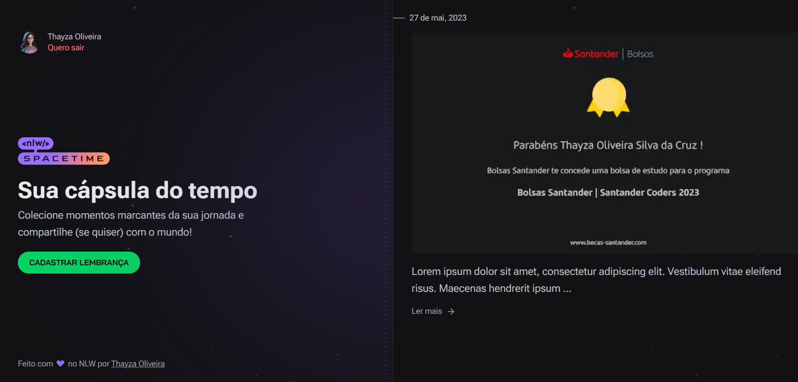

<h1 align='center'><strong> CÁPSULA DO TEMPO ⏳🚀👩🏻‍🚀✨<h1></strong>
<h2><strong> Sobre o projeto<h2></strong>

Página desenvolvida com Backend, Frontend e Banco de Dados na Next Level Week Spacetime da RocketSeat. Esse projeto visa ser uma cápsula do tempo na qual são armazenadas memórias, contendo o registro em imagem e um texto descritivo.

  

<h2><em> Funcionalidades</em> </h2>

<h3><strong>✅ Autenticação com GitHub</h3></strong>

 Ao se conectar à página para que o usuário seja logado, ao clicar em '<strong>crie sua conta</strong>' ocorrerá um redirecionamento para autenticar-se com o GitHub. E, assim, será possível obter os dados do usuário como o nome e foto. Para isso foi utilizada a tecnologia NextAuth.js.

<h3><strong> ✅ Listagem de memórias</h3></strong>

Ao se conectar com a página, já estando autenticado com o GitHub, o usuário terá como página principal a listagem de suas memórias cadastradas. Essa funcionalidade é feita por meio de uma busca no banco de dados carregando o token do usuário logado, e retornando um array de memórias e então elas são mapeadas e organizadas na interface final. Caso esse array esteja vazio, a página sugerindo para o usuário criar uma nova memória será renderizada. 

<h3><strong>✅  Criação de nova memória</h3></strong>

 Para criar uma nova memória, basta que o usuário clique no botão cadastrar lembrança ou então, para a primeira memória clicar em 'criar agora' ao lado direito da página. Será solicitado o arquivo em mídia, um texto descritivo e um check caso seja desejado tornar a memória pública.

#

#### <h3 align="center"> Esse projeto foi desenvolvido com </h3>

### 
 **TypeScript | TailwindCSS | React | Next.js | Prisma | Zod | Figma | Node.js | Git | GitHub** 

